# Urban App


This Urban app is clean feature easy buying productions ecommerce that REST api from Urban store 
is define from Backend ecommerce-api and with process payment Bakong khqr that genearte standard from ```NBC (National Bank of Cambodia)``` 

## Images Overview

<table>
  <tr>
    <td>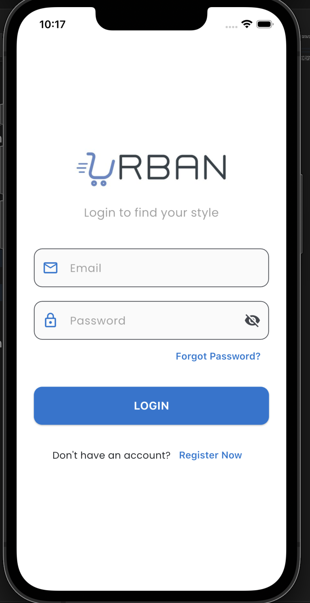</td>
    <td>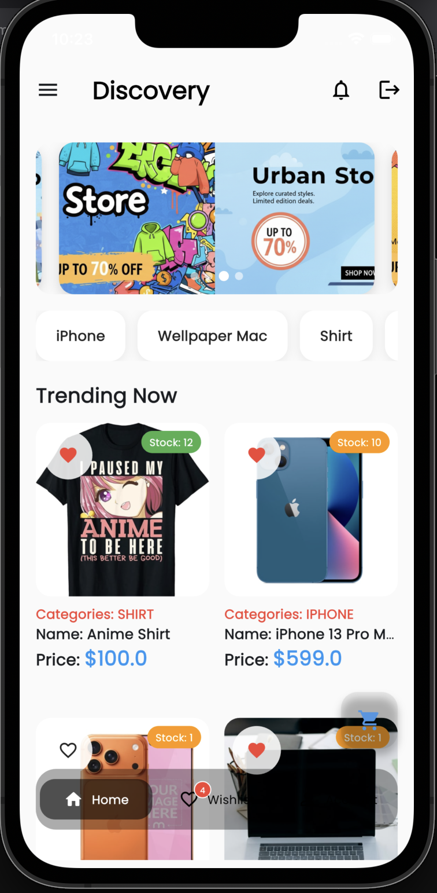</td>
    <td>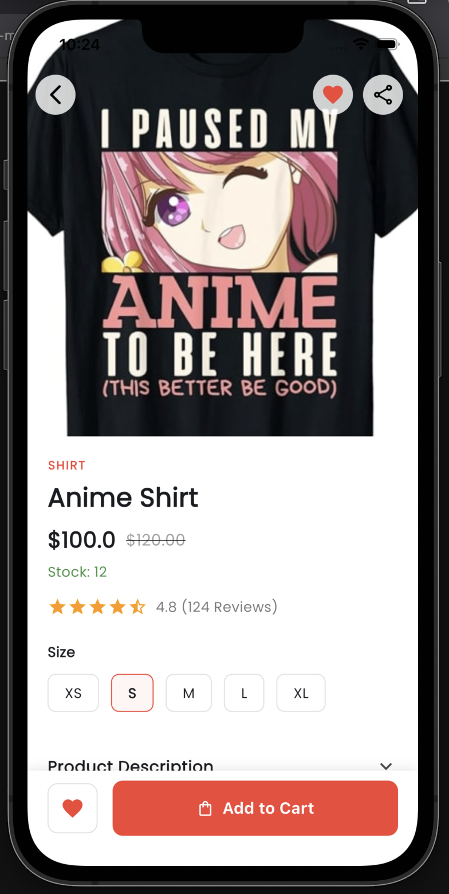</td>
    <td>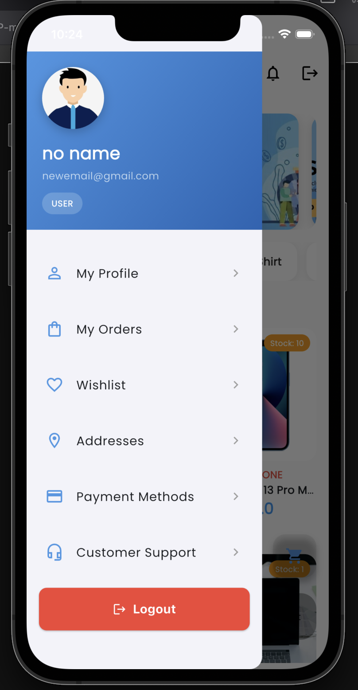</td>
  </tr>
  <tr>
    <td>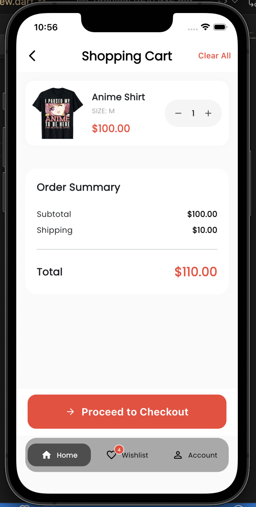</td>
    <td>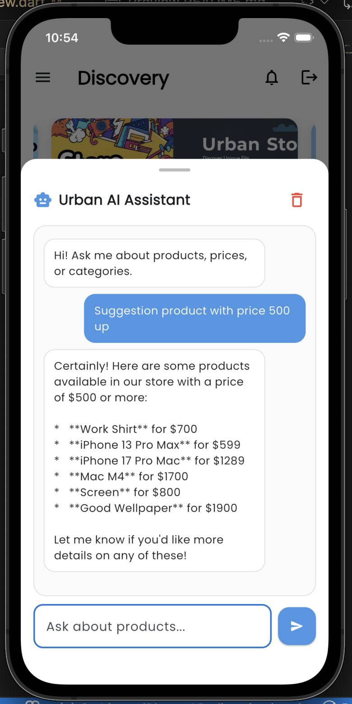</td>
    <td>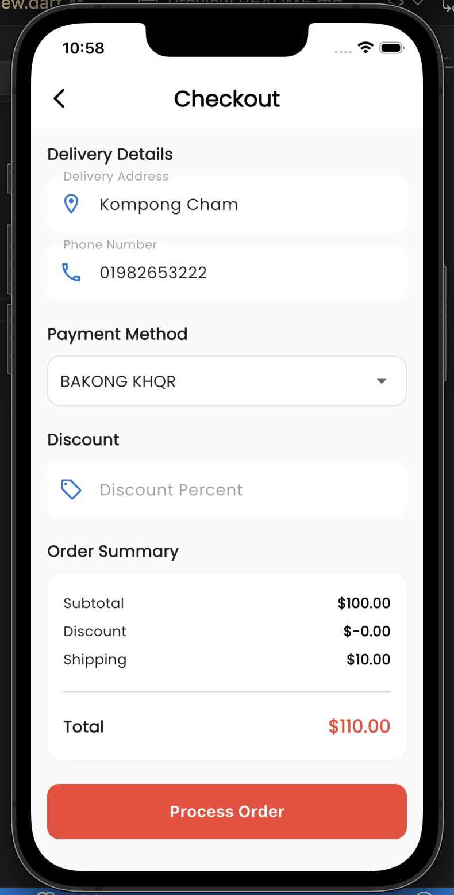</td>
    <td>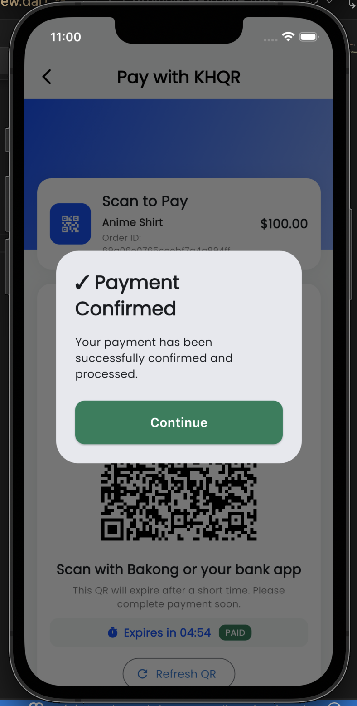</td>
  </tr>
  <tr>
    <td>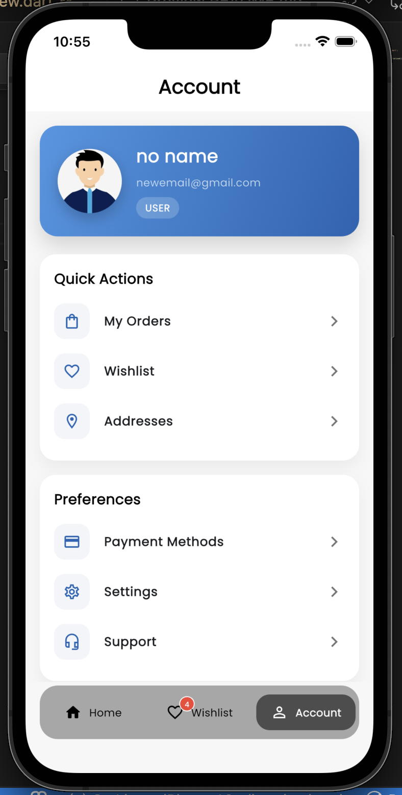</td>
    <td>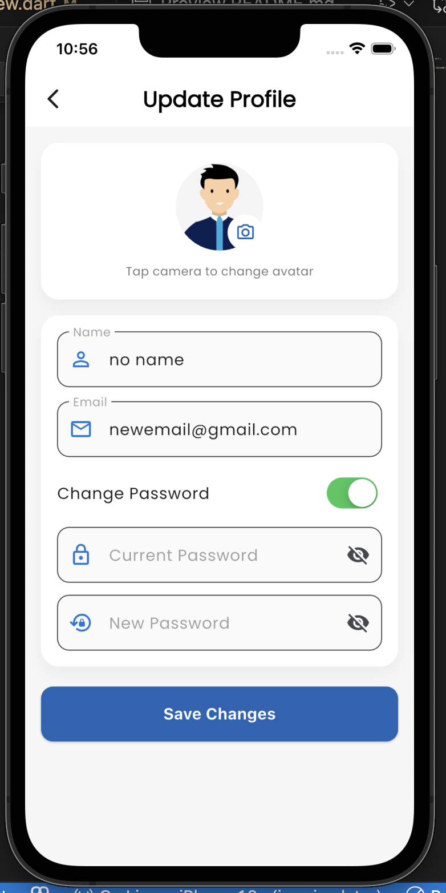</td>
    <td>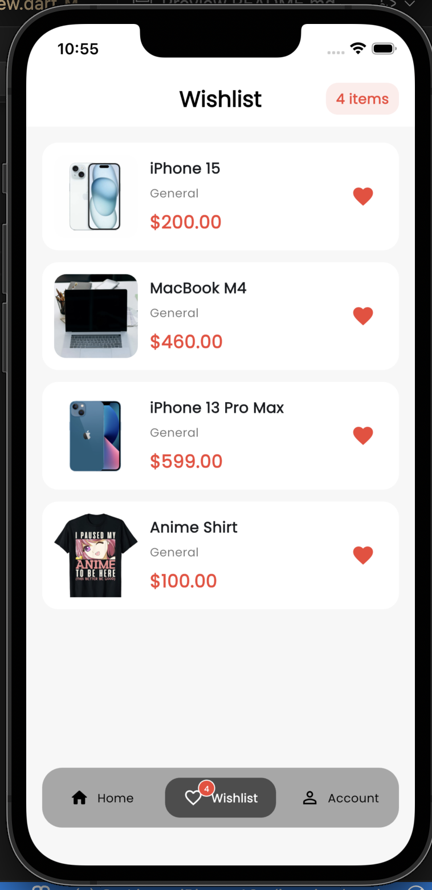</td>
  </tr>
</table>


And have other page more!